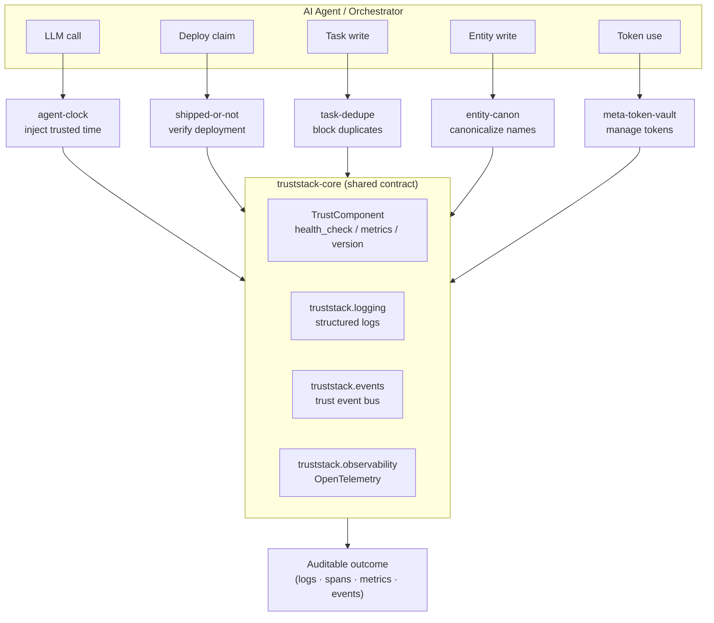

# Trust Stack — Architecture

## Layering

Every library is a thin, focused **trust check** that sits between an agent and an
action (an LLM call, a deploy claim, a task/entity write, a token use). They all
share one foundation, `truststack-core`.



## The shared contract (`truststack-core`)

Every component implements `TrustComponent`:

```python
class TrustComponent(Protocol):
    def version(self) -> str: ...
    async def health_check(self) -> HealthStatus: ...
    async def metrics(self) -> ComponentMetrics: ...
```

- **`truststack.core`** — `TrustComponent`, `BaseTrustComponent`, `HealthStatus`,
  `HealthState`, `ComponentMetrics`, and a `MetricRegistry` for counters/gauges.
- **`truststack.logging`** — structured (JSON) logging via `structlog`, bound with a
  `component` field and a per-request `correlation_id`.
- **`truststack.events`** — `TrustEvent` (Pydantic) base + an async `EventBus`
  (`subscribe` / `publish`) so trust decisions are observable side-channels.
- **`truststack.observability`** — OpenTelemetry tracer/meter helpers and a
  `@traced` async decorator; no-ops safely when no SDK is configured.

## Per-library shape

```text
packages/<lib>/
├── pyproject.toml          # name = "truststack-<lib>"; depends on truststack-core
├── README.md               # problem · install · usage · API
├── src/<import_name>/
│   ├── __init__.py         # public API + version()/health_check()/metrics()
│   ├── models.py           # Pydantic v2 request/result models
│   ├── <core impl>.py      # the trust logic
│   ├── backends/           # pluggable storage/integration adapters
│   └── py.typed
├── tests/                  # pytest-asyncio, 95%+ coverage
└── examples/               # runnable scripts
```

## Cross-cutting principles

1. **Async-first** — all I/O is `async`; sync helpers wrap async where ergonomic.
2. **Pluggable backends** — storage/integration behind a `Protocol`; local-only
   default (SQLite / in-memory) so every library runs with zero infrastructure.
3. **Fail toward distrust** — when a check cannot be completed, the safe/negative
   verdict is returned (`UNVERIFIED`, `duplicate=unknown→block`, etc.).
4. **Everything is evidence** — each decision emits a structured log, an OTEL span,
   and a `TrustEvent`, and updates metrics.
5. **Independently installable** — no library imports another library; the only
   shared dependency is `truststack-core`.
